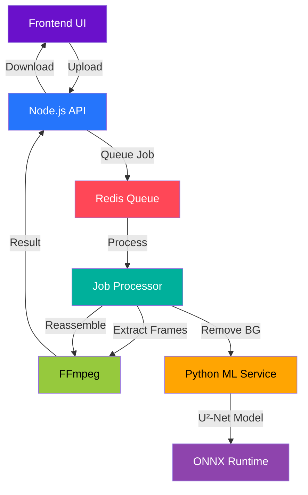

# 🎨 REBAG – Remove Background AI Generator


<div align="center">


**Local-first background removal for images and videos • No GPU required • Fully open-source**

[Quick Start](#-quick-start) • [Demo](#-live-demo) • [API](#-api) • [Deploy](#-deploy-on-render)

</div>

## ✨ Features

<table>
<tr>
<td width="50%">

### 🖼️ Image Processing
- **Instant background removal** (0.3-1.2 seconds)
- **Multiple formats**: JPG, PNG, WebP
- **High quality**: Transparent PNG output
- **Batch-ready**: Queue system for multiple files

</td>
<td width="50%">

### 🎬 Video Processing
- **Frame-by-frame background removal**
- **Preserves original FPS & duration**
- **Format support**: MP4, MOV, AVI
- **Optimized pipeline**: FFmpeg + AI inference

</td>
</tr>
<tr>
<td>

### 🚀 Performance
- **CPU-only inference** (no GPU needed)
- **Redis-powered queue** for stability
- **Memory-efficient** frame processing
- **Auto cleanup** of temporary files

</td>
<td>

### ☁️ Deployment
- **One-click Render deployment**
- **Docker-ready** architecture
- **Microservices**: Node.js + Python
- **Production-ready** configuration

</td>
</tr>
</table>

## 🏗️ Architecture



## 📊 System Requirements & Performance

### 🖥️ Minimum Hardware (Functional)
| Component | Minimum | Recommended |
|-----------|---------|-------------|
| **CPU** | Intel i3 / AMD Ryzen 3 | Intel i5 / AMD Ryzen 5 |
| **RAM** | 8 GB | 16 GB |
| **Storage** | HDD (100MB free) | SSD (1GB free) |
| **GPU** | Not required | Not required |
| **OS** | Linux/Windows/macOS | Linux/Windows/macOS |

### ⚡ Performance Benchmarks (CPU-Only)

#### 🖼️ Image Processing
| Image Size | First Run | Subsequent Runs | Memory Usage |
|------------|-----------|----------------|--------------|
| 512×512 | 1.2-1.8s | 0.3-0.6s | ~500MB |
| 1024×1024 | 1.5-2.2s | 0.6-1.2s | ~500MB |
| 4K (3840×2160) | 3.5-5s | 1.8-3s | ~700MB |

#### 🎬 Video Processing (per frame)
| Resolution | FPS | Processing Time | Estimated Total* |
|------------|-----|----------------|------------------|
| 720p (1280×720) | 12 FPS | 0.7-1.2s/frame | 30-45 mins (3min video) |
| 1080p (1920×1080) | 12 FPS | 1.0-1.8s/frame | 45-65 mins (3min video) |
| 720p (1280×720) | 24 FPS | 0.7-1.2s/frame | 60-90 mins (3min video) |

*Includes FFmpeg frame extraction/reassembly (2-4 mins)*

### 💡 Optimization Tips
1. **Use SSD storage** for faster frame I/O
2. **Process videos at 12 FPS** - minimal quality loss
3. **Limit video length** to 1-3 minutes for reasonable wait times
4. **Enable Redis persistence** for job recovery
5. **Use Render's paid plans** for video processing (>1min)

## 🛠️ Tech Stack

### Backend Services
| Technology | Version | Purpose |
|------------|---------|---------|
| **Node.js** | ≥18.0.0 | API server & job orchestration |
| **Express.js** | 5.x | REST API framework |
| **Redis** | 7.x | Job queue & caching |
| **Bull Queue** | 4.x | Redis-based job processing |
| **FFmpeg** | 5.x/6.x | Video frame extraction/reassembly |

### Machine Learning
| Library | Version | Model | Size |
|---------|---------|-------|------|
| **Python** | ≥3.8 | Runtime environment | - |
| **rembg** | ≥2.0.69 | Background removal wrapper | - |
| **U²-Net** | ONNX format | Segmentation model | **176MB** |
| **ONNX Runtime** | ≥1.18.0 | CPU inference engine | - |

### Frontend
| Technology | Purpose |
|------------|---------|
| **Vanilla JavaScript** | No framework dependencies |
| **HTML5 & CSS3** | Modern, responsive UI |
| **Fetch API** | Async job polling |
| **Drag & Drop** | File upload UX |

### Deployment
| Service | Tier | Purpose |
|---------|------|---------|
| **Render** | Free/Starter | Hosting (backend, ML, Redis) |
| **Docker** | Optional | Containerization |
| **GitHub** | - | Source control |

## 🚀 Quick Start

### Prerequisites
```bash
# Required system packages
sudo apt-get update
sudo apt-get install -y ffmpeg redis-server python3-pip nodejs npm
```

### 1. Clone & Setup
```bash
# Clone repository
git clone https://github.com/yourusername/rebag.git
cd rebag

# Install backend dependencies
cd backend
npm install

# Install ML dependencies
cd ../ml
pip install -r requirements.txt

# Download AI model (176MB)
bash model/download-model.sh
```

### 2. Configure Environment
```bash
# Copy example environment file
cd backend
cp .env.example .env

# Edit .env with your settings
nano .env
```

### 3. Start Services
```bash
# Terminal 1: Start Redis
redis-server

# Terminal 2: Start ML service
cd ml
python bg_removal_service.py

# Terminal 3: Start backend
cd backend
npm start
```

### 4. Access the Web Interface
Open your browser and navigate to:
```
http://localhost:3000
```

## 🌐 Live Demo

[](https://rebag.onrender.com)

*Note: Render free tier may spin down after inactivity.*

## 📡 API Reference

### Endpoints Overview
| Method | Endpoint | Description | Response Time |
|--------|----------|-------------|---------------|
| `POST` | `/api/upload/image` | Upload image for BG removal | 1-2s (queue) |
| `POST` | `/api/upload/video` | Upload video for BG removal | 2-5s (queue) |
| `GET`  | `/api/jobs/{jobId}` | Check job status | <100ms |
| `GET`  | `/api/health` | System health check | <50ms |

### Example: Image Processing
```bash
curl -X POST \
  -F "file=@photo.jpg" \
  http://localhost:3000/api/upload/image
```

**Response:**
```json
{
  "success": true,
  "jobId": "job_abc123",
  "message": "Image upload accepted. Processing started."
}
```

### Polling for Results
```bash
# Check job status
curl http://localhost:3000/api/jobs/job_abc123

# Download result (when completed)
# Result available at: /processed/{filename}
```

## ☁️ Deploy on Render

### One-Click Deployment
[](https://render.com/deploy?repo=https://github.com/yourusername/rebag)

### Manual Deployment Steps
1. **Fork** this repository to your GitHub account
2. **Sign up** for [Render](https://render.com) (free tier available)
3. **Create new Blueprint** and connect your repository
4. **Review configuration** (`render.yaml` is auto-detected)
5. **Deploy** - Render automatically provisions:
   - Node.js backend service
   - Python ML microservice
   - Redis instance
   - Scheduled cleanup job

### Render Resource Estimates
| Service | Free Tier | Starter Tier | Recommended |
|---------|-----------|--------------|-------------|
| **Backend** | 512MB RAM | 1GB RAM | **Starter** |
| **ML Service** | 512MB RAM | 1GB RAM | **Starter** |
| **Redis** | 30MB RAM | 100MB RAM | Free |

## 📈 Performance Optimization

### For Faster Processing
```javascript
// Adjust in backend/.env
MAX_IMAGE_SIZE=5242880      // 5MB limit for faster processing
MAX_VIDEO_SIZE=20971520     // 20MB limit for shorter videos
FRAME_EXTRACTION_FPS=12     // Process 12 FPS instead of 24
```

### For Better Quality
```python
# In ml/bg_removal_service.py
# Use post-processing for cleaner edges
output_image = remove(input_image, 
                     post_process_mask=True,  # Clean up mask
                     alpha_matting=True,      # Better transparency
                     alpha_matting_foreground_threshold=240)
```

## 🔧 Advanced Configuration

### Docker Deployment
```dockerfile
# Build and run with Docker Compose
docker-compose up --build
```

### Custom Model Integration
```python
# Replace U²-Net with another model
# In ml/bg_removal_service.py
from rembg import remove
from rembg.session_factory import new_session

# Use different model
session = new_session("u2netp")  # Smaller, faster
# or: session = new_session("u2net_human_seg")  # People only
```

### Scaling for Production
1. **Increase Redis memory** for larger queues
2. **Add multiple ML service instances** with load balancing
3. **Use S3/cloud storage** for uploaded files
4. **Implement CDN** for result distribution
5. **Add monitoring** with Prometheus + Grafana

## 🚨 Limitations & Solutions

| Limitation | Impact | Solution |
|------------|--------|----------|
| **CPU-only processing** | Slower than GPU | Use lower FPS (12 instead of 30) |
| **Video length** | Long processing times | Limit to 1-3 minute videos |
| **Memory usage** | ~500MB per process | Queue limits concurrent jobs |
| **Free tier hosting** | Service spin-down | Use paid plans for production |
| **Transparent video support** | Limited player support | Convert to MOV with alpha |

## 📄 License

This project is licensed under the MIT License - see the [LICENSE](LICENSE) file for details.

## 🤝 Contributing

Contributions are welcome! Please feel free to submit a Pull Request.

1. Fork the repository
2. Create your feature branch (`git checkout -b feature/AmazingFeature`)
3. Commit your changes (`git commit -m 'Add some AmazingFeature'`)
4. Push to the branch (`git push origin feature/AmazingFeature`)
5. Open a Pull Request

## 🙏 Acknowledgments

- **U²-Net Model**: Xuebin Qin et al. for the excellent segmentation model
- **rembg Library**: Daniel Gatis for the Python wrapper
- **FFmpeg**: For robust video processing
- **Render**: For free tier hosting
- **Bull Queue**: For Redis-based job processing

## 📞 Support

- **Issues**: [GitHub Issues](https://github.com/yourusername/rebag/issues)
- **Discussions**: [GitHub Discussions](https://github.com/yourusername/rebag/discussions)
- **Email**: support@rebag.dev

## 🌟 Star History

[](https://star-history.com/#yourusername/rebag&Date)

---

<div align="center">

**REBAG** – Making background removal accessible, private, and local-first.

[Get Started](#-quick-start) • [View Code](backend/) • [Report Issue](https://github.com/yourusername/rebag/issues)


</div>
